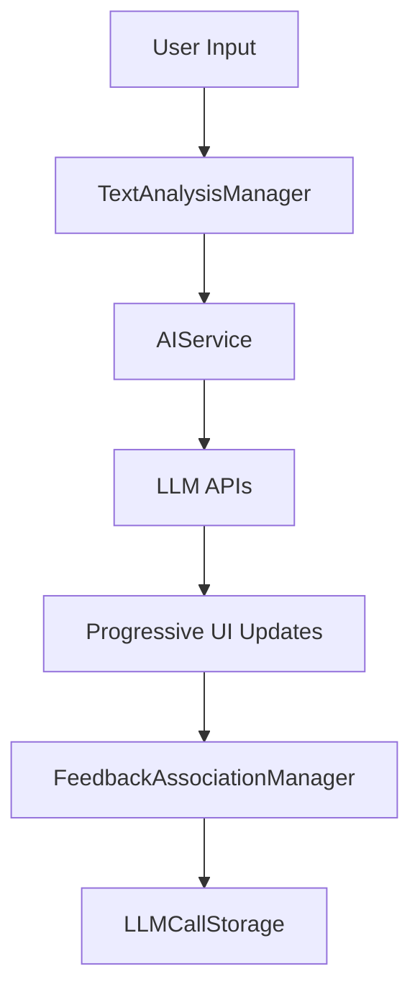

# Architecture

## Overview

AI Text Editor follows a component-based architecture with manager classes handling specific functionality areas.

## Core Application Structure

```
├── index.html              # Three-panel responsive layout
├── script.js               # Main AITextEditor orchestrator
├── components/             # Modular ES6 classes
│   ├── managers/          # Core functionality managers
│   ├── features/          # Feature-specific managers
│   └── utilities/         # Reusable components
└── LLM.js                 # Direct LLM API integration
```

## Component Architecture Pattern

The application uses a manager-based pattern where each major functionality area has its own class:

### Core Managers

#### AIService.js
- Direct LLM API calls via LLM.js
- Progressive loading and parallel execution
- Error handling and retry logic

#### FileSystemManager.js
- File System Access API integration
- Directory selection and file operations
- Persistent file handle management

#### EditorManager.js
- CodeMirror wrapper with syntax highlighting
- File content management
- Modification tracking

#### UIManager.js
- UI state management
- Mobile navigation and responsive layout
- Resizable panels and tab switching

#### SettingsManager.js
- User preferences with localStorage persistence
- API key management
- Theme and editor configuration

### Feature Managers

#### PromptsManager.js
- Custom prompt CRUD operations
- Template variable processing
- localStorage-based persistence

#### HistoryManager.js
- LLM call history tracking
- Timeline and search functionality
- Pagination for large datasets

#### ThemeManager.js
- Dark/light mode switching
- CSS custom property management
- Automatic theme detection

## Data Flow



### Key Data Flow Steps

1. **User Input**: Text entered in CodeMirror editor
2. **Analysis Trigger**: TextAnalysisManager detects completion events
3. **Debounced Processing**: 1-second delay prevents excessive calls
4. **Parallel Execution**: Multiple prompts processed simultaneously
5. **Progressive Updates**: UI updates as each response arrives
6. **Data Persistence**: All interactions stored for history

## Storage Architecture

### Client-Side Storage
- **localStorage**: Settings, prompts, session state
- **IndexedDB**: LLM call history and large datasets
- **File System Access API**: Direct file operations
- **In-Memory**: Active file handles and UI state

### Data Models

#### Settings Data
```javascript
{
  fontFamily: "JetBrains Mono",
  fontSize: 14,
  aiEnabled: true,
  apiKey: "...",
  llmService: "groq",
  theme: "auto"
}
```

#### Prompt Data
```javascript
{
  id: "uuid",
  name: "Grammar Check",
  content: "Check this {text} for grammar errors",
  enabled: true,
  created: timestamp
}
```

## Event-Driven Communication

Components communicate through a custom event system:

```javascript
// Publishing events
this.eventBus.publish('file-changed', { filename, content });

// Subscribing to events
this.eventBus.subscribe('theme-changed', this.updateTheme.bind(this));
```

## Error Handling Strategy

### Graceful Degradation
- AI features disabled when API unavailable
- Fallback UI states for missing components
- Progressive enhancement for modern features

### User Feedback
- Toast notifications for user actions
- Clear error messages with suggested actions
- Connection status indicators

## Performance Considerations

### Debouncing and Throttling
- Text analysis debounced to 1 second
- UI updates throttled for smooth performance
- API calls batched when possible

### Memory Management
- Cleanup methods for all managers
- Event listener removal on component destruction
- Efficient data structures for large datasets

## Security

### API Key Protection
- Keys stored in localStorage (client-side only)
- No server-side storage or transmission
- User responsible for key security

### CORS Handling
- Direct API calls to LLM providers
- Proper error handling for CORS restrictions
- Fallback mechanisms for restricted environments